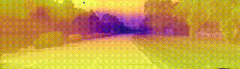
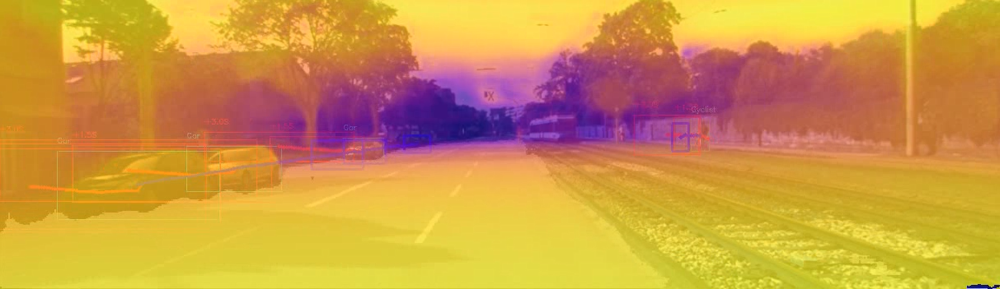
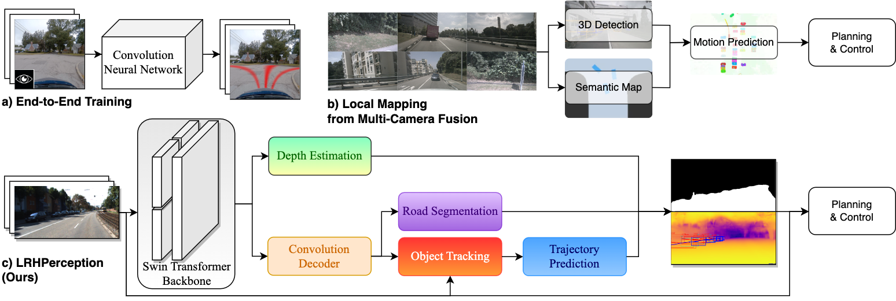

# Single-Eye View: Monocular Real-time Perception Package for Autonomous Driving

<figcaption style="text-align: center;">
The quartet of images depicts the output of LRHPerception, with past trajectories delineated in blue and future trajectory predictions in red. The upper pair of images exemplifies two Success Cases, while the lower duo present one Failure Case.
</figcaption>

## Visualization
Short demo in GIF here

Extensive demo here

# Architecture

<figcaption style="text-align: center;">
Innovation and architecture blueprint: a) Paradigm of end-to-end solution b) Paradigm of camera-fusion for local map solution c) Paradigm of our LRHPerception package, extracts essences from monocular camera for cost-info trade-off.
</figcaption>

## Code
Codes will be released upon paper acceptance

# Datasets

Download to `./datasets`

You can download all the KITTI raw datasets with a single command using the repository available at [this repo](https://github.com/Deepak3994/Kitti-Dataset).

# Checkpoints

Integrated checkpoints:

​	`_C.CKPT.ORI_CKPT + _C.CKPT.TRAJ_PRED_CKPT`

# Run

`export PYTHONPATH=$pwd:PYTHONPATH`

`python ./tools/main.py`

## Inference

`_C.TRAIN.TASKS = "pred"`

Run on KITTI: 

​	`_C.EVAL.DATASET_NAME == 'kitti_raw'`

Visualize:

​	`_C.VISUALIZE = True`

​	Saved path: `<_C.EVAL.OUTPUT_DIR>/saved_frames`

​	Use `tools/frame2video.py` to render video

Test Speed:

​	`_C.EVAL.SPEED_TEST = Tr`

## Evaluation
`_C.TRAIN.TASK = 'pred'`

Evaluate segmentation on city dataset: 

    `_C.EVAL.TASK = 'seg'`
    
    `_C.EVAL.SEG_DATASET = 'city'`

Evaluate depth:
    `_C.EVAL.TASK = 'depth'`

## Training

Checkpoints output directory:

​	`<_C.TRAIN.OUTPUT_DIR>/<_C_TRAIN.TASKS>/checkpoints`

Train from scratch: 

​	`_C. TRAIN.START_NEW = True`

Train every module with checkpoints loaded: 

​	`_C. TRAIN.START_NEW = False`

​	`_C.TRAIN.ALL = True`

Train individual backbone + neck + task head；

​	Road segmentation: `_C.TRAIN.TASKS = 'seg'`

​	Detection: ` _C.TRAIN.TASKS = 'det'`

Train backbone + depth:

​	`_C.TRAIN.TASKS = 'depth'`

Other training:

​	Backbone + Neck + Detection Head + Segmentation Head:

​		`_C.TRAIN.TASKS = 'det-seg'`

